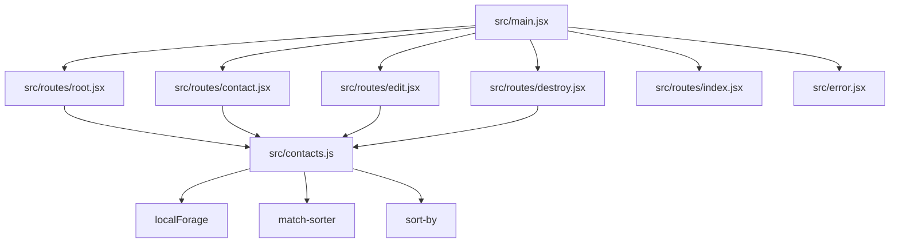

# 🧩 Module Dependency View

```mermaid
flowchart TD
    Main[src/main.jsx] --> Root[src/routes/root.jsx]
    Main --> Contact[src/routes/contact.jsx]
    Main --> Edit[src/routes/edit.jsx]
    Main --> Destroy[src/routes/destroy.jsx]
    Main --> Index[src/routes/index.jsx]
    Main --> Error[src/error.jsx]
    Root --> Data[src/contacts.js]
    Contact --> Data
    Edit --> Data
    Destroy --> Data
    Data --> LocalForage[localForage]
    Data --> Matcher[match-sorter]
    Data --> Sorter[sort-by]
```

`src/contacts2.js` is present but is not imported by the inspected application entry.
