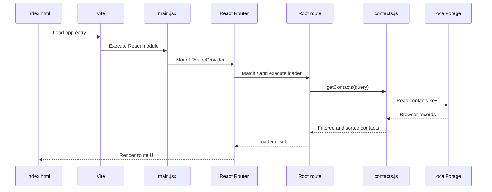

# ▶️ Runtime Sequence

```mermaid
sequenceDiagram
    participant HTML as index.html
    participant Vite
    participant Main as main.jsx
    participant Router as React Router
    participant Root as Root route
    participant Data as contacts.js
    participant Store as localForage
    HTML->>Vite: Load app entry
    Vite->>Main: Execute React module
    Main->>Router: Mount RouterProvider
    Router->>Root: Match / and execute loader
    Root->>Data: getContacts(query)
    Data->>Store: Read contacts key
    Store-->>Data: Browser records
    Data-->>Root: Filtered and sorted contacts
    Root-->>Router: Loader result
    Router-->>HTML: Render route UI
```
