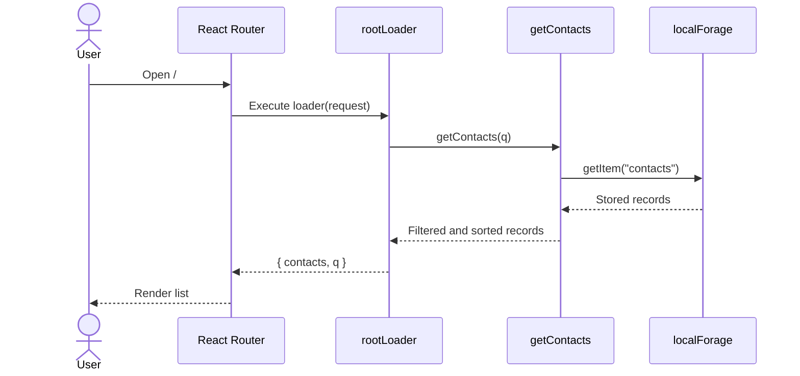
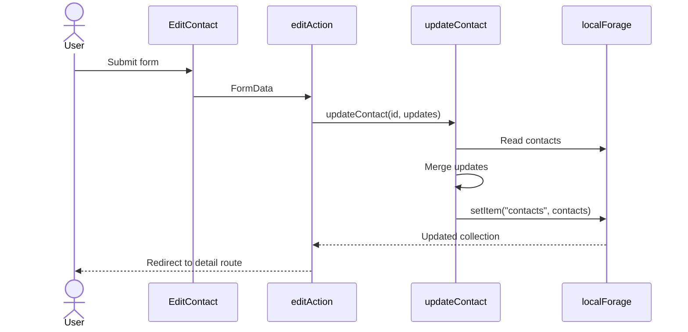
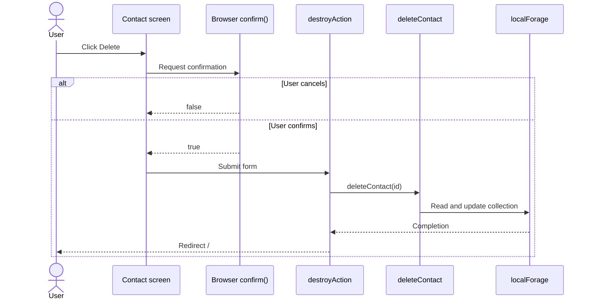

# 🔁 Sequence Flows

## 📇 Contact list

```mermaid
sequenceDiagram
    actor User
    participant Router as React Router
    participant Root as rootLoader
    participant Data as getContacts
    participant Store as localForage
    User->>Router: Open /
    Router->>Root: Execute loader(request)
    Root->>Data: getContacts(q)
    Data->>Store: getItem("contacts")
    Store-->>Data: Stored records
    Data-->>Root: Filtered and sorted records
    Root-->>Router: { contacts, q }
    Router-->>User: Render list
```

## ✏️ Edit record

```mermaid
sequenceDiagram
    actor User
    participant Edit as EditContact
    participant Router as editAction
    participant Data as updateContact
    participant Store as localForage
    User->>Edit: Submit form
    Edit->>Router: FormData
    Router->>Data: updateContact(id, updates)
    Data->>Store: Read contacts
    Data->>Data: Merge updates
    Data->>Store: setItem("contacts", contacts)
    Store-->>Router: Updated collection
    Router-->>User: Redirect to detail route
```

## 🗑️ Delete record

```mermaid
sequenceDiagram
    actor User
    participant Detail as Contact screen
    participant Confirm as Browser confirm()
    participant Action as destroyAction
    participant Data as deleteContact
    participant Store as localForage
    User->>Detail: Click Delete
    Detail->>Confirm: Request confirmation
    alt User cancels
      Confirm-->>Detail: false
    else User confirms
      Confirm-->>Detail: true
      Detail->>Action: Submit form
      Action->>Data: deleteContact(id)
      Data->>Store: Read and update collection
      Store-->>Action: Completion
      Action-->>User: Redirect /
    end
```
