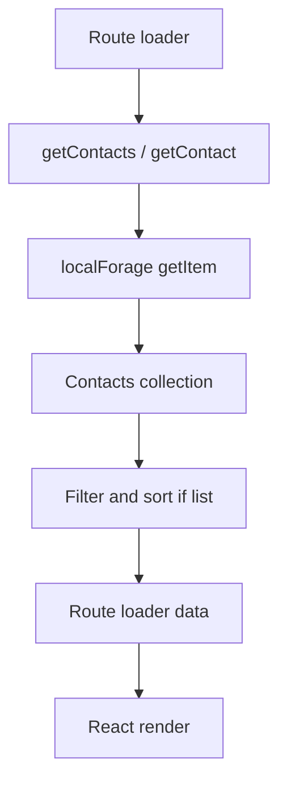
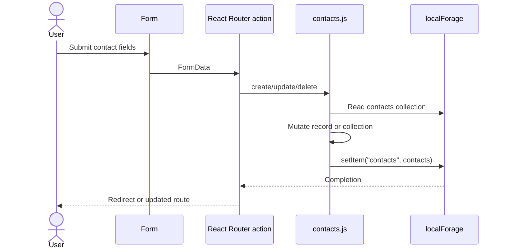

# 🔀 Data Flow

## 📥 Read flow

```mermaid
flowchart TD
    A[Route loader] --> B[getContacts / getContact]
    B --> C[localForage getItem]
    C --> D[Contacts collection]
    D --> E[Filter and sort if list]
    E --> F[Route loader data]
    F --> G[React render]
```

## ✍️ Write flow

```mermaid
sequenceDiagram
    actor User
    participant Form
    participant Router as React Router action
    participant Helper as contacts.js
    participant Store as localForage
    User->>Form: Submit contact fields
    Form->>Router: FormData
    Router->>Helper: create/update/delete
    Helper->>Store: Read contacts collection
    Helper->>Helper: Mutate record or collection
    Helper->>Store: setItem("contacts", contacts)
    Store-->>Router: Completion
    Router-->>User: Redirect or updated route
```

All data operations are client-side in the inspected implementation. No remote API or database is shown.
